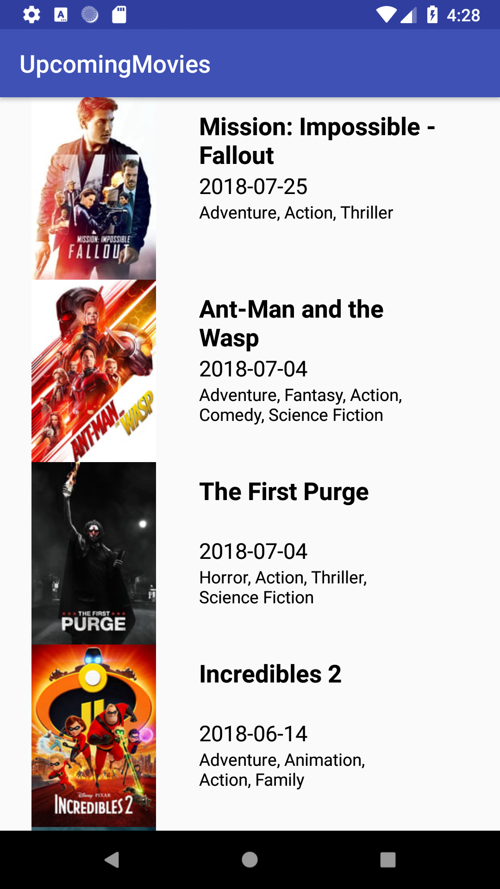
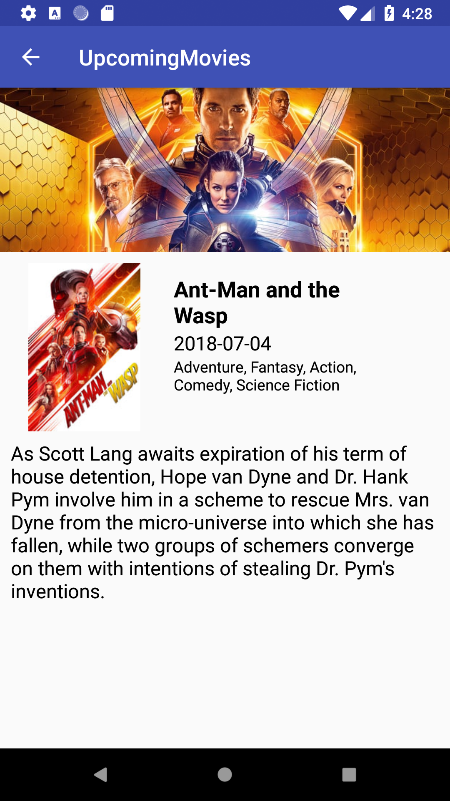

Upcoming Movies Coding Challenge using Kotlin, RxJava2, Retrofit2, Room, LiveData, Dagger2 and MVVM
=============================================================================================

This application displays all the upcoming movies and it's details from [MovieDB API](https://developers.themoviedb.org/3).

Libraries / Technologies Used
------------------------------

  - RxJava2 + Kotlin: Reactive Programming make really easy to deal with UI interactions/events, asynchronous tasks and implementing the Observer Pattern. Kotlin Programming Language presents advantages over Java such as null safety, data classes, lambdas and extensions capability
  - Retrofit2 / OkHTTP3: REST Client that provides an easy way to handle JSON data
  - Room: Robust database implementing caching in an elegant structure
  - LiveData: Observable data that respects the lifecycle of Android components
  - Dagger2: Dependency injection in a versatile way using annotations
  - MVVM: Model-View-ViewModel design pattern that provides uncoupling and play nicely with Reactive Programming
  - Glide: easy to use image loading framework for Android

Features
---------

 - Home: list of upcoming movies (including movie name, poster image, genre and release date). Loads the movies while scrolling.
 - Movie Details: display the movie information (including movie name, poster image, backdrop image, genre, release date and overview)
 - Adaptive Layout for Portrait and Landscape orientations
 - Caching Data using Room

Screenshots
------------

TODO
-----

 - Unit Tests
 - Finish the Search Feature
